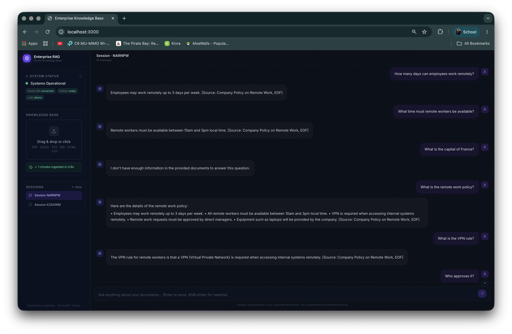

# Enterprise RAG & GenAI Knowledge Base

[](https://python.org)
[](https://fastapi.tiangolo.com)
[](https://langchain.com)
[](https://trychroma.com)
[](https://docker.com)
[](LICENSE)

A production-ready Retrieval-Augmented Generation (RAG) API. Upload documents, ask questions in natural language, receive grounded answers with source citations — zero hallucinations by design.

---

<p align="center">
  
</p>

**See it in action:** Upload your documents → Ask questions in natural language → Get AI-powered answers with exact source citations.

### ✨ Key Features

- 📄 **Multi-format Ingestion** — PDF, DOCX, TXT, MD, HTML, CSV  
- 🔍 **Semantic Search** — Find relevant context using embeddings  
- 💬 **Conversational RAG** — Chat with citations, session history  
- ⚡ **Streaming Responses** — Real-time token-by-token answers  
- 🛡️ **No Halluci nations** — Grounded answers backed by source documents  
- 🐳 **Production Ready** — Docker, scaling, comprehensive API  

---

## Architecture

```
                        ┌─────────────────────────────────────────┐
                        │              FastAPI Service            │
                        │  POST /upload  POST /query  GET /health │
                        └────────┬───────────────┬────────────────┘
                                 │               │
               ┌─────────────────▼──┐     ┌──────▼──────────────────┐
               │  Ingestion Pipeline│     │     RAG Chain (LCEL)    │
               │  load → chunk →    │     │  condense → retrieve →  │
               │  embed → upsert    │     │  prompt → LLM → cite    │
               └─────────┬──────────┘     └──────┬──────────────────┘
                         │                       │
               ┌─────────▼───────────────────────▼──────┐
               │     ChromaDB  (embedded, persistent)   │
               │     BAAI/bge-small-en-v1.5 · 384-dim   │
               └────────────────────────────────────────┘
                                      │
                          ┌───────────▼────────────┐
                          │    LLM Backend         │
                          │ Ollama · OpenAI · Azure│
                          └────────────────────────┘
```

---

## Tech Stack

| Layer | Technology |
|---|---|
| API Framework | FastAPI 0.115, Uvicorn, Pydantic v2 |
| RAG Orchestration | LangChain 0.2 (LCEL), LangChain-Community |
| Embedding Model | `BAAI/bge-small-en-v1.5` via sentence-transformers (384-dim) |
| Vector Database | ChromaDB 0.5 — embedded, persistent, no server required |
| LLM Backends | Ollama (local) · OpenAI · Azure OpenAI |
| Document Loaders | PyPDF, python-docx, Unstructured (HTML, CSV, MD, TXT) |
| Logging | Loguru — structured, rotating, JSONL |
| Containerisation | Docker, Docker Compose v2 |

---

## Quick Start (Docker)

```bash
# 1. Clone and enter the project
git clone <repo-url> && cd enterprise-rag

# 2. Configure environment
cp .env.example .env          # edit LLM_PROVIDER / keys as needed

# 3. Build and start
docker compose build
docker compose up -d

# 4. Pull the LLM (first time only — ~2 GB)
docker compose exec ollama ollama pull llama3.2:3b

# 5. Verify
curl http://localhost:8000/health
```

Interactive API docs → **http://localhost:8000/docs**

---

## Local Development (without Docker)

**Requirements:** Python 3.11+, [Ollama](https://ollama.com/download) installed natively.

```bash
# Create and activate virtual environment
python3 -m venv .venv
source .venv/bin/activate        # Windows: .venv\Scripts\Activate.ps1

# Install dependencies
pip3 install -r requirements.txt

# Set Python path
export PYTHONPATH=$(pwd)         # Windows: $env:PYTHONPATH = (Get-Location).Path

# Configure environment
cp .env.example .env
# Set OLLAMA_BASE_URL=http://localhost:11434 in .env

# Start Ollama and pull a model
ollama serve &
ollama pull llama3.2:3b

# Start the API with hot-reload
uvicorn app.main:app --reload --host 0.0.0.0 --port 8000
```

---

## API Reference

### `GET /health`
Returns the status of all system dependencies.

```bash
curl http://localhost:8000/health
```
```json
{
  "status": "ok",
  "chromadb": "connected",
  "embedding_model": "BAAI/bge-small-en-v1.5 (loaded)",
  "llm_provider": "ollama",
  "version": "1.0.0"
}
```

---

### `POST /upload`
Ingest a document into the knowledge base. Supported formats: **PDF, DOCX, TXT, MD, HTML, CSV**.

```bash
curl -X POST http://localhost:8000/upload \
     -F "file=@/path/to/your/document.pdf"
```
```json
{
  "message": "'document.pdf' ingested successfully.",
  "file_name": "document.pdf",
  "total_child_chunks": 42,
  "total_parent_chunks": 12,
  "duration_seconds": 3.71,
  "collection": "knowledge_base"
}
```

---

### `POST /query`
Ask a question. Returns a grounded answer with source citations.

```bash
curl -X POST http://localhost:8000/query \
     -H "Content-Type: application/json" \
     -d '{"question": "What is the refund policy?", "session_id": "user-abc"}'
```
```json
{
  "answer": "The refund policy allows returns within 30 days. [Source: policy.pdf, p.3]",
  "sources": [
    {
      "file_name": "policy.pdf",
      "source": "/app/data/uploads/policy.pdf",
      "chunk_id": "3f2a1b...",
      "page": 3,
      "snippet": "Returns are accepted within 30 days of purchase..."
    }
  ],
  "session_id": "user-abc",
  "retrieved_chunks": 6,
  "latency_ms": 1243.5
}
```

**Query parameters:**

| Field | Type | Default | Description |
|---|---|---|---|
| `question` | string | required | Natural-language question (3–2000 chars) |
| `session_id` | string | `"default"` | Conversation thread ID — maintains chat history |
| `top_k` | int | `6` | Number of chunks retrieved from ChromaDB |
| `use_parent_retriever` | bool | `true` | Return parent chunks for richer context |

---

### `POST /query/stream`
Same as `/query` but streams the answer token-by-token via **Server-Sent Events**.

```bash
curl -X POST http://localhost:8000/query/stream \
     -H "Content-Type: application/json" \
     -d '{"question": "Summarise the key policies", "session_id": "user-abc"}'
```

Each SSE event: `data: {"token": "The "}` — terminated by `data: [DONE]`.

---

### `DELETE /query/session/{session_id}`
Clear the chat history for a session.

```bash
curl -X DELETE http://localhost:8000/query/session/user-abc
```

---

## Bulk Ingestion (CLI)

```bash
# Ingest a single file
python3 scripts/ingest_bulk.py --path data/raw/report.pdf

# Ingest an entire directory recursively
python3 scripts/ingest_bulk.py --path data/raw/

# Dry-run: validate files without writing to ChromaDB
python3 scripts/ingest_bulk.py --path data/raw/ --dry-run

# Override chunk settings at runtime
python3 scripts/ingest_bulk.py --path data/raw/ --chunk-size 256 --chunk-overlap 32
```

---

## Configuration

All settings are environment variables. Copy `.env.example` to `.env` and edit.

| Variable | Default | Description |
|---|---|---|
| `LLM_PROVIDER` | `ollama` | `ollama` · `openai` · `azure_openai` |
| `LLM_MODEL` | `llama3.2:3b` | Model tag for the chosen provider |
| `OLLAMA_BASE_URL` | `http://localhost:11434` | Ollama server URL |
| `OPENAI_API_KEY` | — | Required when `LLM_PROVIDER=openai` |
| `EMBEDDING_MODEL` | `BAAI/bge-small-en-v1.5` | HuggingFace model name |
| `EMBEDDING_DEVICE` | `cpu` | `cpu` · `cuda` · `mps` |
| `COLLECTION_NAME` | `knowledge_base` | ChromaDB collection |
| `CHROMA_PERSIST_DIR` | `./storage/chroma` | On-disk vector store path |
| `CHUNK_SIZE` | `512` | Child chunk character size |
| `CHUNK_OVERLAP` | `64` | Overlap between consecutive chunks |
| `RETRIEVER_TOP_K` | `6` | Chunks retrieved per query |
| `MAX_UPLOAD_SIZE_MB` | `50` | Maximum file upload size |
| `LOG_LEVEL` | `INFO` | `DEBUG` · `INFO` · `WARNING` · `ERROR` |

---

## Project Structure

```
.
├── app/
│   ├── main.py                  # FastAPI factory, lifespan, middleware
│   ├── api/
│   │   ├── dependencies.py      # Shared dependency injection
│   │   ├── middleware/
│   │   │   └── logging.py       # Request logging, X-Request-ID header
│   │   └── routes/
│   │       ├── health.py        # GET  /health
│   │       ├── upload.py        # POST /upload
│   │       └── query.py         # POST /query, /query/stream, DELETE /session
│   ├── core/
│   │   ├── config.py            # Pydantic Settings singleton
│   │   └── logging.py           # Loguru structured logging setup
│   ├── ingestion/
│   │   ├── loader.py            # Multi-format document loader
│   │   ├── splitter.py          # Dual-granularity chunker (child + parent)
│   │   ├── embedder.py          # HuggingFace embedding model singleton
│   │   └── pipeline.py          # Orchestrates load → chunk → embed → upsert
│   ├── retrieval/
│   │   ├── vector_store.py      # ChromaDB client wrapper
│   │   ├── retriever.py         # StandardRetriever / ParentAwareRetriever
│   │   ├── prompts.py           # Anti-hallucination prompt templates
│   │   ├── chain.py             # LCEL QA chain, session history, streaming
│   │   └── llm.py               # LLM factory (Ollama / OpenAI / Azure)
│   └── models/
│       ├── requests.py          # Pydantic request schemas
│       └── responses.py         # Pydantic response schemas
├── scripts/
│   └── ingest_bulk.py           # CLI ingestion script
├── tests/
│   ├── conftest.py              # Shared fixtures, mocked singletons
│   ├── unit/                    # Splitter, loader unit tests
│   └── integration/             # API endpoint and retriever tests
├── data/
│   ├── raw/                     # Source documents (git-ignored)
│   └── uploads/                 # API-uploaded files (git-ignored)
├── storage/chroma/              # ChromaDB on-disk store (git-ignored)
├── Dockerfile                   # Multi-stage production image
├── docker-compose.yml           # Production stack
├── docker-compose.override.yml  # Dev overrides (hot-reload)
├── .env.example                 # Environment variable template
├── requirements.txt             # Production dependencies
├── requirements-dev.txt         # Dev + test dependencies
└── Makefile                     # Convenience commands
```

---

## Development Commands

```bash
make build        # Build Docker image
make up           # Start stack (dev mode, hot-reload)
make down         # Stop containers
make logs         # Follow API logs
make shell        # Shell into running container
make pull-model   # Pull LLM into Ollama
make test         # Run full test suite with coverage
make lint         # ruff + mypy
make format       # black + ruff --fix
make clean        # Remove containers and volumes (destructive)
```

---

## Hallucination Prevention

The QA chain enforces grounded answers through three independent layers:

1. **`temperature=0`** on every LLM provider — no sampling randomness.
2. **Anti-hallucination system prompt** — five explicit rules: use only provided context, never fabricate facts, cite every claim, disclose conflicts, and output a defined fallback phrase when context is insufficient.
3. **Source-header formatting** — every retrieved chunk is prefixed with `[N] Source: filename, p.X` before the LLM sees it, making citation natural and verifiable.

---

## Code Quality & Robustness

Recent improvements focus on production-grade reliability:

- **Comprehensive Error Handling** — All critical operations (embedding model loading, ChromaDB operations, vector store upserts) include try-catch blocks with contextual logging and meaningful error messages.
- **Enhanced Type Hints** — Full type annotations across the codebase for better IDE support and type checking.
- **Improved Documentation** — Detailed docstrings with parameter descriptions, return types, and exception documentation for all public functions.
- **Request Validation** — Pydantic v2 models with custom validators for security (session ID sanitization, query validation) and field documentation.
- **Structured Logging** — Request ID correlation, timing metrics, and JSONL-formatted log files for monitoring and debugging.
- **API Middleware** — Request/response timing headers and unique request tracking for end-to-end observability.

---

## License

MIT © 2025 Md. Sakibul Islam
